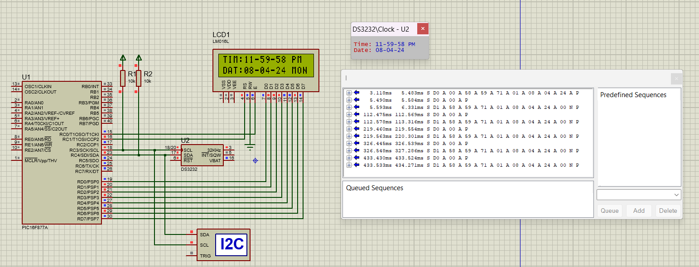
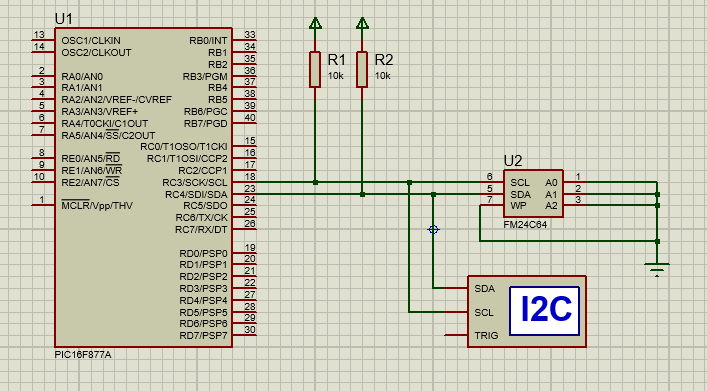
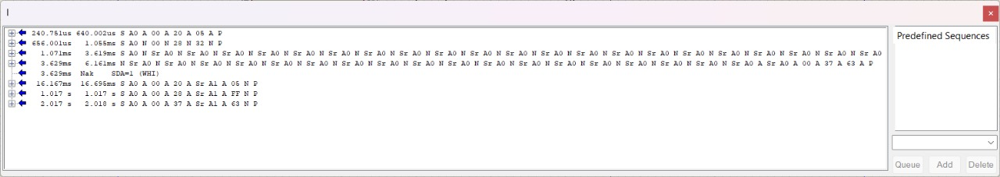

## Firmware Drivers Development
RTC and EEPROM are interfaced by developing the bare metal drivers without libraries through memory mapping in the PIC16F877A microcontroller, which uses the I2C protocol for communication with the PIC.
### RTC

### EEPROM

